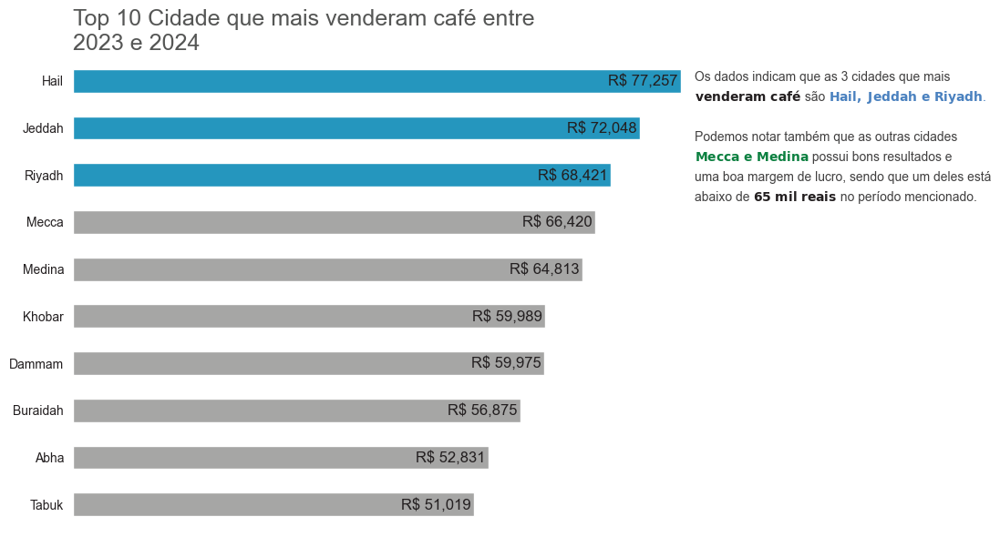
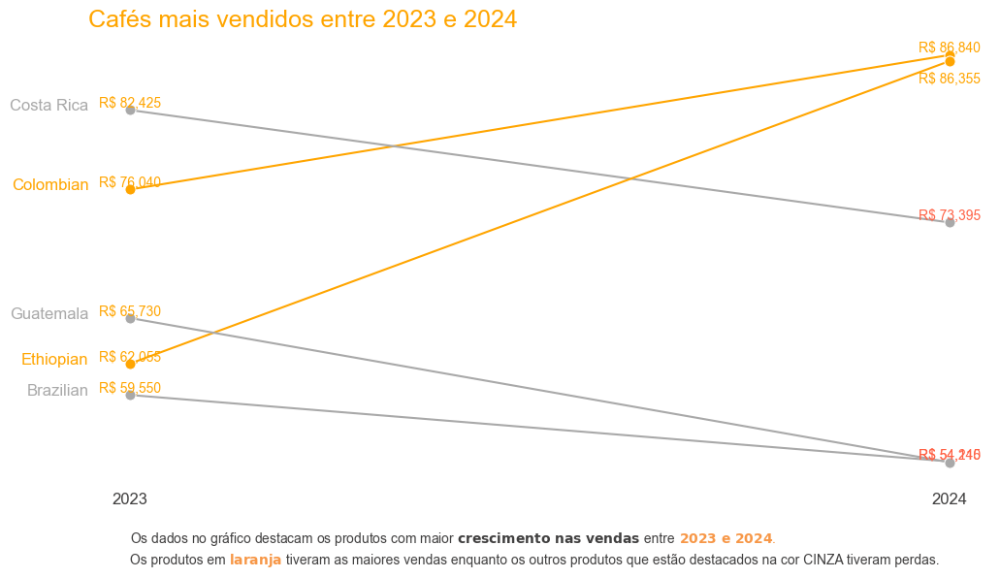

# Análise de Vendas de Café na Arábia Saudita

Este repositório apresenta um estudo detalhado sobre o mercado de café na Arábia Saudita, analisando padrões de vendas, tendências e insights valiosos por meio de visualizações de dados.

## Objetivo
O estudo busca compreender o comportamento das vendas de café no mercado saudita, identificando as principais cidades consumidoras, a distribuição de vendas e padrões sazonais de consumo.

## Conjunto de Dados
Os dados utilizados na análise são provenientes do arquivo `DatasetForCoffeeSales2.csv`, contendo informações sobre:
- Cidades
- Volume de vendas
- Valores de receita

## Análises Realizadas

### Distribuição das Vendas por Cidade
O volume de vendas de café na Arábia Saudita é concentrado em algumas regiões-chave. A análise revelou que determinadas cidades possuem um consumo significativamente maior em relação às demais.



### Tendências de Consumo
Foi observado que o consumo de café não é uniforme ao longo do tempo. Certos meses do ano apresentam uma demanda significativamente maior, possivelmente devido a fatores culturais e climáticos.



## Como Executar
1. Clone o repositório:
   ```bash
   git clone https://github.com/seu-usuario/seu-repositorio.git
   ```
2. Instale as dependências:
   ```bash
   pip install -r requirements.txt
   ```
3. Acesse a pasta `notebooks/` e abra o arquivo `analise-coffee.ipynb` para explorar os detalhes da análise.

## Conclusão
A análise das vendas de café na Arábia Saudita forneceu insights valiosos sobre os padrões de consumo e as cidades que mais contribuem para o mercado. Essas informações podem ser utilizadas para tomadas de decisão estratégicas e otimização de vendas.

